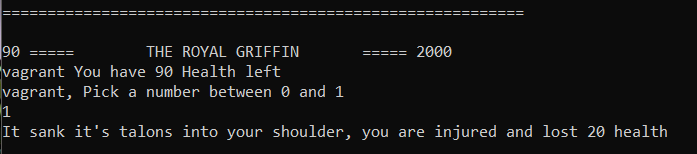
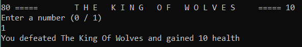
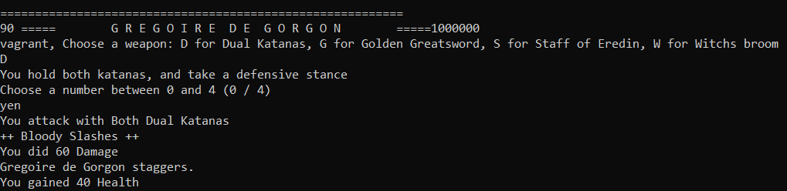

<h1 align="center">Bash scripting</h1>

   

<h2 align="center">Projects</h2>

### [Bestday](bestday.sh)  
Usage
```commandline
./bestday.sh
```  
Or add to .bashrc on a newline  
```commandline
bash /path/to/dir/bestday.sh
```  
Tells the machine to run with bash. This file can be configured at startup to give you a good day start.
  


### [Get-rich-quick](getrichquick.sh)
This script reads user input and creates aliases, using a random parameter to perform "predictions"  
 To run  
```commandline
./getrichquick.sh
```


### [Witcher3](witcher3.sh)
This script reads uses user input, conditionals and some randomized options to make a commandline interactive gaem(game)  
 To run  
```commandline
./witcher3.sh
```  
Class/weapon choosing has effects in later stages  


#### Only 3 Bosses exist for this release
- **yen** might help  




<h2>✔Project Owner</h2>

<table>
  <tr>
  <td align="center"><a href="https://github.com/Jesulayomy"><br /><sub><b>Jesulayomy</b></sub></a></td>
  </tr>
</table>


<h2>Contributors</h2>

<table>
  <tr>
  <td align="center"><a href="https://github.com/Jesulayomy"><br /><sub><b>Jesulayomy</b></sub></a></td>
  </tr>
</table>
  
You can reach me through:  
<a href="https://twitter.com/Jesulayomi11"></a> <a href="https://www.linkedin.com/in/jesulayomi-aina-27389524a/"></a> <a href="https://discordapp.com/users/488238079753060353"></a>

