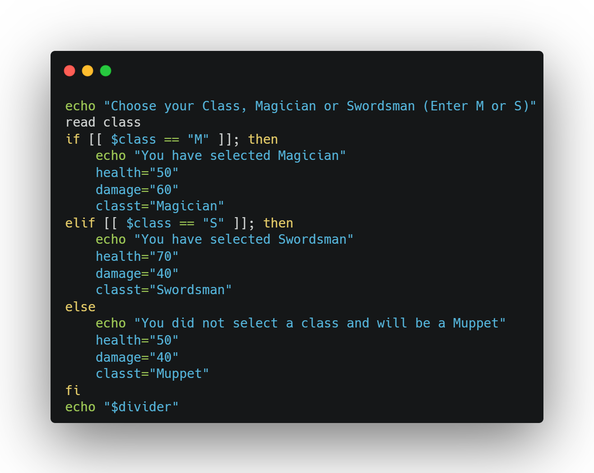

<h1 align="center">Bash scripting</h1>

  

<h2 align="center">Projects</h2>

### [Bestday](bestday.sh)
Usage
```commandline
./bestday.sh
```
Or add to .bashrc on a newline
```commandline
bash /path/to/dir/bestday.sh
```
Tells the machine to run with bash. This file can be configured at startup to give you a good day start.


### [Get-rich-quick](getrichquick.sh)
This script reads user input and creates aliases, using a random parameter to perform "predictions"
 To run
```commandline
./getrichquick.sh
```


### [Witcher3](witcher3.sh)
This script reads uses user input, conditionals and some randomized options to make a commandline interactive gaem(game)
 To run
```commandline
./witcher3.sh
```
Class/weapon choosing has effects in later stages


